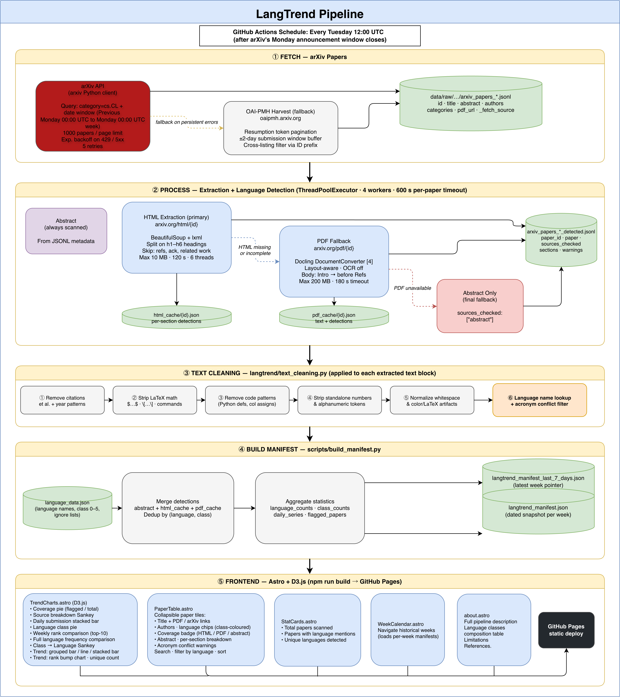

# LangTrend

**LangTrend** is a weekly pipeline that scans arXiv `cs.CL` submissions, detects which human languages are explicitly mentioned in paper text, and publishes an interactive dashboard tracking language representation trends over time.

Live site: [kavindu-w.github.io/langtrend](https://kavindu-w.github.io/langtrend)

---

## Pipeline



The pipeline is cache-aware at every step: existing JSONL, `html_cache/`, and `pdf_cache/` files are reused unless explicitly cleared.

---

## Language Classes

Languages class descriptions are adapted from the resource-availability taxonomy from Joshi et al. [3]. Counts and example languages are updated from the <a
          href="https://github.com/NisansaDdS/Some-Languages-are-More-Equal-than-Others"
          target="_blank"
          rel="noreferrer"><u>Some Languages are More Equal than Others</u></a
        > repository, which follows the work from <a
          href="https://doi.org/10.18653/v1/2022.aacl-main.62"
          target="_blank"
          rel="noreferrer"><u>Ranathunga and de Silva [2]</u></a
        >.
| Class | Description | Languages tracked | Examples |
|-------|-------------|:-----------------:|---------|
| 0 | Exceptionally limited resources; rarely considered in language technologies | 6,134 | Pinyin, Irarutu, Himarimã |
| 1 | Some unlabelled data; collecting labelled data is challenging | 130 | Hawaiian, Frisian, Nahuatl |
| 2 | Small set of labelled datasets; active language support communities | 96 | Sinhala, Irish, Zulu |
| 3 | Strong web presence and cultural community; highly benefited by unsupervised pre-training | 30 | Hindi, Tamil, Urdu |
| 4 | Large unlabelled data and significant labelled data; dedicated NLP research communities | 22 | Indonesian, Russian, Italian |
| 5 | Dominant online presence; massive investment in resources and technologies | 7 | Arabic, Chinese, English |

---

## Limitations

- **Detection coverage** — Language detection is based on explicit mentions in titles, abstracts, section text, and cleaned PDF body text, so indirect references (e.g., citing a multilingual dataset without naming the languages) can be missed. Furthermore, the pipeline may produce false positives (shorter language names in particular can appear as acronyms, author names, or technical terms). While text cleaning and acronym filtering are applied to reduce these, users should always verify flagged languages directly in the paper.
- **Extraction fallback** — HTML extraction is preferred for accuracy, but the pipeline depends on the availability of arXiv HTML pages. If the HTML version is missing or incomplete, the pipeline falls back to the PDF (via Docling). If the PDF is also unavailable or has been withdrawn, only the abstract text is analysed.
- **cs.CL scope only** — The pipeline only covers papers submitted to the <code>cs.CL</code> arXiv category (It may include multiple categories, which include <code>cs.CL</code>). Multilingual NLP papers appearing in adjacent categories (cs.AI, cs.LG, cs.CV, etc.), which exclude <code>cs.CL</code> are not captured.
- **No paper version tracking** — Papers are processed at fetch time. If an author updates a paper with new or removed language mentions, these are not reflected unless the pipeline re-runs for the same date window.
- **Weekly cadence** —  The pipeline runs once a week (every Tuesday), covering the previous week's arXiv announcement window. As a result, papers that fall across the date boundary may be missed in a given snapshot.

---

## Setup

### Dependencies

Python version: 3.13.3 (see `.python-version`)

```bash
make setup
```

### Submodule

The language classification data is maintained in a submodule:

```bash
git submodule update --init --recursive
```

To pull the latest classification updates:

```bash
git submodule update --remote
```

---

## Local usage

Run the full data pipeline and build the site:

```bash
make build
```

Start the dev server:

```bash
make dev
```

Individual pipeline steps:

```bash
make fetch        # Step 1 — fetch arXiv metadata (skips if JSONL exists)
make fetch-oai    # Step 1 — force OAI-PMH path
make process      # Step 2 — extract text and detect languages
make reprocess    # Step 2 — re-run detection using cached downloads
make manifest     # Step 3 — rebuild manifest JSON from cached results
make pipeline     # Steps 1–3 — full data run
```

---

## GitHub Actions

The workflow at `.github/workflows/langtrend.yml` runs automatically every **Tuesday at 12:00 UTC** (after arXiv's Monday announcement window closes). It can also be triggered manually or on push to the main branch.

Steps executed by the workflow:

1. Fetch arXiv `cs.CL` papers for the past 7 days
2. Extract and clean text (HTML → PDF → abstract fallback)
3. Build the manifest JSON
4. Build the Astro static site
5. Deploy to GitHub Pages

---

## References

1. S. Ranathunga, N. De Silva, D. Jayakody, and A. Fernando, "Shoulders of Giants: A Look at the Degree and Utility of Openness in NLP Research," in *Proc. 62nd Annual Meeting of the Association for Computational Linguistics (Volume 2: Short Papers)*, Bangkok, Thailand, Aug. 2024, pp. 519–529. doi: [10.18653/v1/2024.acl-short.48](https://doi.org/10.18653/v1/2024.acl-short.48)

2. S. Ranathunga and N. de Silva, "Some Languages are More Equal than Others: Probing Deeper into the Linguistic Disparity in the NLP World," in *Proc. 2nd Conference of the Asia-Pacific Chapter of the ACL and the 12th IJCNLP (Volume 1: Long Papers)*, Online, Nov. 2022, pp. 823–848. doi: [10.18653/v1/2022.aacl-main.62](https://doi.org/10.18653/v1/2022.aacl-main.62)

3. P. Joshi, S. Santy, A. Budhiraja, K. Bali, and M. Choudhury, "The State and Fate of Linguistic Diversity and Inclusion in the NLP World," in *Proc. 58th Annual Meeting of the Association for Computational Linguistics*, Online, Jul. 2020, pp. 6282–6293. doi: [10.18653/v1/2020.acl-main.560](https://doi.org/10.18653/v1/2020.acl-main.560)

4. C. Auer et al., "Docling Technical Report," 2024, arXiv. doi: [10.48550/ARXIV.2408.09869](https://doi.org/10.48550/ARXIV.2408.09869)

---

This project builds on the ideas, code and data from [2] and [4], with assistance from GitHub Copilot and Claude.